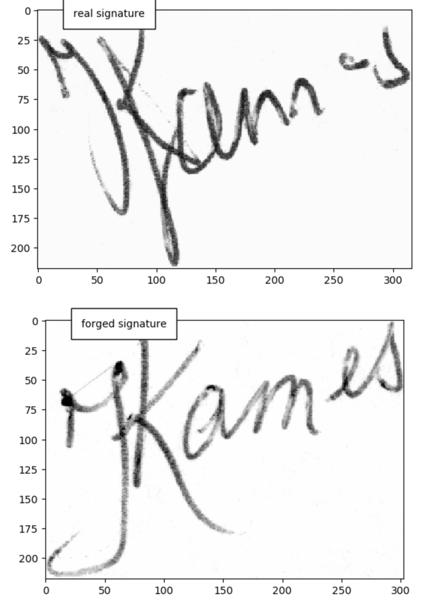
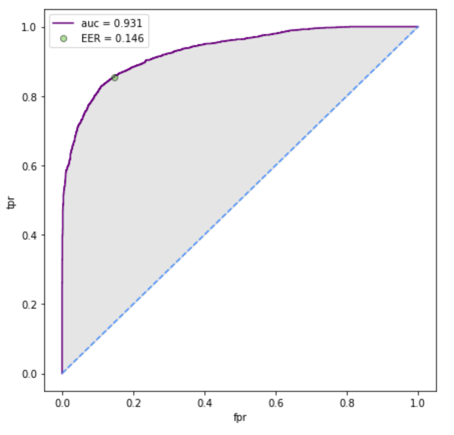

# Project Definition

## Overview
The domain for this project is banking and more specifically check fraud.  Stealing, washing, and altering checks is an increasingly significant issue.  One method to detect this type of fraud is to verify the signature on the check with known good customer signatures.  To accomplish this, a model can be trained on pairs of real and forged signatures.  If a forged signature is detected with sufficient confidence, then payment can be stopped and additional protections placed on the customers account.

The proposed solution is developing and deploying a Siamese neural network model to determine if a signature is a forgery when compared to a known good signature.  The model will take a pair of images as input, and classify whether or not they are a match.  Since one of the images will be a known good signature, if they do not match, then a forged signature has been detected. The model itself will utilize a Pytorch pretrained model, and will be similar to the example provided by Pytorch, [link here](https://github.com/pytorch/examples/tree/main/siamese_network).  The structure of a Siamese neural network is described in detail [here](https://en.wikipedia.org/wiki/Siamese_neural_network), but the general approach is to have two identical nns whose output goes into a common linear layer and then a sigmoid layer.  The loss function used to train the model can be BCELoss, Triplet loss, or Contrastive Loss.  In this case, the BCELoss will be used.  

The data that will be used for this project is from Kaggle, and this is the [link](https://www.kaggle.com/datasets/robinreni/signature-verification-dataset).  It consists of genuine and forged signatures from Dutch people.  The data comes from ICDAR 2011 SIgnature Verification Comeptition, [linked here](http://www.iapr-tc11.org/mediawiki/index.php/ICDAR_2011_Signature_Verification_Competition_(SigComp2011)).

## Problem Statement
The problem is detecting forged signatures on checks.  This is a fraud pattern that is an increasing concern for financial institutions within the US.  The idea for this issue is to focus on the signature on the check image that is scanned when deposited, and compare that signature to either a signature card or a known good check.  Thus, the problem at had is to build a model that can take a pair of images as an input, and output a probability of the two images being written by the same person.

## Metrics
The metrics to judge the performance of this model will be the ROC AUC and the EER (Equal Error Rate).  The ROC AUC and the EER will give a sense of the overall predictive power of the model.  The AUC is independent of a chosen probability threshold, so it gives a sense for how predictive the model could be.  In practice, a particular threshold will be chosen, and that will have a corresponding true positive and false positive rates.  One such threshold choice gives the EER where the false negative rate and the false positive rate are equal.  This metric provides a comparison point to other models that can be found in the literature for this problem.

# Analysis

## Data Exploration and Exploratory Visualization
To give a sense of what the data looks like, here is an example of two real signatures in figure \ref{ex_real_sigs}

From these images, it is inuitively clear that these signatures are written by the same person.  There are subtle variations in stroke that seem natural.  The challenge for the model is to take into account these natural variations to keep the false positive rate low.

See figure \ref{ex_rf_sigs} for an example of a real and forged signature:

Similar to the two real images, it is inuitively clear that these signatures come from different individuals.  The differences are noticably unnatural and really jump out as clearly different. Thus, the modeling challenge is to find a latent representation of these images that can be used to distinguish them as being different.

Beyond the images themselves, the other distinguishing feature of this data is the relatively balanced classes in the train and test data sets that are provided.  Figure \ref{imb_train} and \ref{imb_test} show the number of image pairs in each class for training and testing data sets.

This balance is ideal for model training and doesn't require implementation of down/up sampling techniques.

The overall number of available signature pairs that are available for training is 23,205 and 5,747 for testing.  This consists of pairs of signatures that are either both real or real and forged.  If they are both real, then the pair has a label of 0.  If the pair has a forged signature, then the label is 1. Thus the modeling task at hand will be a binary classification problem.

## Algorithms and Techniques 

## Benchmark
Much work has already been done in this domain and on this particular problem.  The solution that is developed here can be compared to published work from [this paper](https://arxiv.org/pdf/1705.05787.pdf).  With that paper, this solution can be compared to a Linear SVM model and other neural net models. From that paper, figure \ref{model_comp} shows some metrics of existing state-of-the-art models.

. \label{model_comp}](./attachments/comparison.PNG)

As can be seen, the EERs of around 2% can currently be achieved.  This data set is different than the kaggle data set that is used for this project, however it can be used to roughly get a sense for what is possible. 

# Methodology

## Data Preprocessing
One of the challenges of working with image data is in preprocessing the data because of variations in background, noise, resolution, and aspect ratio.  Thus, the preprocessing methodology that is used herein is as follows. First, the image is loaded and cast to an 8-bit greyscale image.  Second, the image is normalized and the background is removed using a Otsu thresholding.  Finally, the image is resized to fit a specified resolution.  The resulting images that come out of this preprocessing setup is shown in figures \ref{pre_real} and \ref{pre_rf} for pairs of real signatures and real/forged signatures.

The notebook that explores preprocessing of images is step-0-eda.ipynb.  This is where the initial analysis was performed to gather information about the types of images that are in the data set, and the functions for preprocessing the images to had to a data loader were developed in this nb.

## Implementation and Refinement
The model implementation for this project is a Siamese neural network.  This type of model takes two images as an input, and pass each through an nn before being combined in a linear layer and finally a sigmoid layer.  For this exercise, a pretrained pytorch model is used (ResNet18) and fine tuned.  The structure of this model is very similar to the pytoch example, [link here](https://github.com/pytorch/examples/tree/main/siamese_network), however modifications were made to accomidate the preprocessed images that are created from the original kaggle data set.  One challenge was the choice of loss function to train the model.  There are three main choices that can be used: binary cross entropy loss (BCELoss), triplet loss, or contrastive loss.  The contrastive and triplet loss are better suited to this particular type of model, however they are more difficult to implement.  Thus, BCELoss was selected as the loss function, and that decision was justified by the model's overall robust performance.

The model was trained once using reasonable default hyperparameters (learning rate = 1, batch size = 64, gamma = 0.7).  Since this was done on my personal AWS account, I was very cognizant of the cost for each training job.  Thus, the decision was made to limit the amount of data that was used in training by random downsampling to 10% of the original training dataset.  The model was then evaluated on the full test data set.

Once trained once, hyperparameter tuning was then performed.  This was limit in scope due to the cost of training, so 4 combinations of parameters were examined.  This was done concurrently accrosss 4 processing jobs to save time.  From the initial hyperpramaters, the best estimator (based on the average loss metric) had hyperparameters of (learning rate = 0.1, batch size = 64, gamma = 0.7).

This resulting best estimator after hyperparameter tuning was then deployed to an endpoint to use for inference and further evaluation.

All of this work was done in the step-1-train-and-deploy.ipynb notebook.  The training and hyperperarameter tuning jobs were set up therein, and the model was also deployed to an an endpoint in that notebook.  The scripts that were used as entry points in the training jobs and for endpoint deployment are in the /code/ folder.  This includes functions for model training, testing, and inference.  The model definition, train, and test functions are modified from the official pytorch Siamese neural network example, [linked here](https://github.com/pytorch/examples/tree/main/siamese_network).

# Results

## Model Evaluation and Validation
The final model was evaluated by using the endpoint to receive model scores for the test data set.  This was done by concatenating pairs of images into a numpy array, and then passing them to the endpoint.  From there, an inference script is used to return the model output as a probability of one of the pair of images being a forgery.  As an example, a pair of real signtures and model score is shown in figure \ref{ms_real}, and a pair of real and forged signatures is shown in figure \ref{ms_forged}.  As can be seen from the model scores, a higher number means higher probability of one of the images being forged.

From these scores, the ROC curve was calculated, as well as its AUC and the EER.  Figure \ref{roc_auc} is a plot of the ROC curve with the AUC and EER in the legend.  As can be seen from this figure, the model performance is excellent with an AUC=0.931 and EER=14.1%.  When compared to the above state-of-the-art models, this seems to be close to their performance level.  There are significant differences between this data set and the data set used in figure \ref{model_comp}, however it is still a reasonable benchmark for this model.  This performance is especially encouraging because there would likely be significant gain in predictive power that could be gained by utilizing the full training data set and doing further hyperparameter tuning.

## Justification
Based on the model AUC and EER, this model would perform well in being able to detect forged signatures.  Care would have to be used when applying this model to signatures from different individuals, however it is likely that the model performance would still be acceptable.  Ideally, this endpoint could be used to score checks before it is paid, and this could prevent a very distruptive fraud pattern from happening.