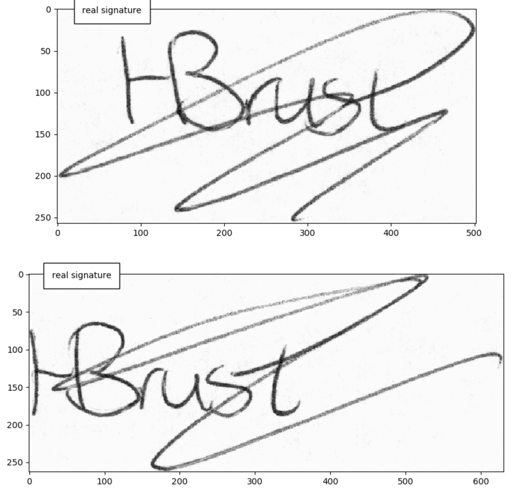
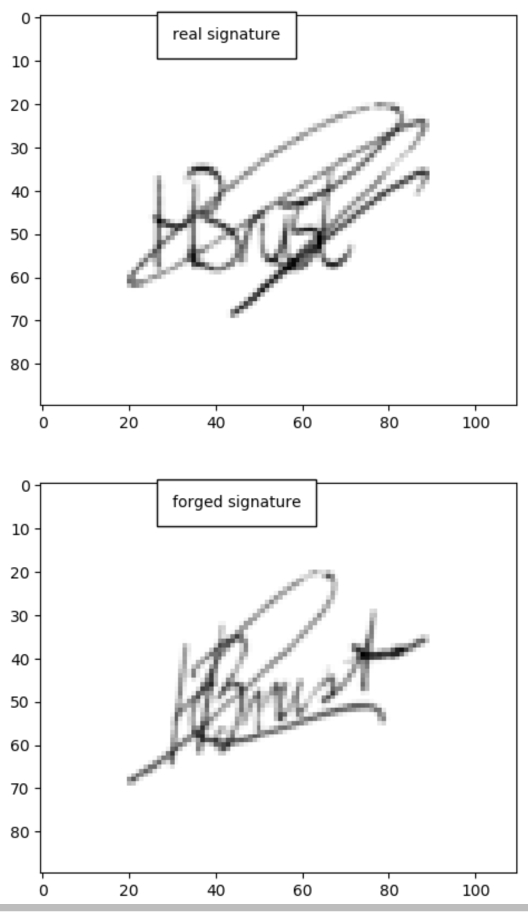

# Project Definition

## Overview
The domain for this project is banking and more specifically check fraud.  Stealing, washing, and altering checks is an increasingly significant issue.  One method to detect this type of fraud is to verify the signature on the check with known good customer signatures.  To accomplish this, a model can be trained on pairs of real and forged signatures.  If a forged signature is detected with sufficient confidence, then payment can be stopped and additional protections placed on the customers account.

## Problem Statement
The problem is detecting forged signatures on checks.  This is a fraud pattern that is an increasing concern for financial institutions within the US.

## Metrics

# Analysis

## Data Exploration

## Exploratory Visualization

## Algorithms and Techniques 

## Benchmark
Much work has already been done in this domain and on this particular problem.  The solution that is developed here can be compared to published work from [this paper](https://arxiv.org/pdf/1705.05787.pdf).  With that paper, this solution can be compared to a Linear SVM model and another neural net model. 

# Methodology

## Data Preprocessing

## Implementation

## Refinement

# Results

## Model Evaluation and Validation

## Justification