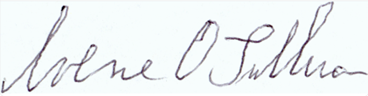

# Udacity Capstone Project Proposal

## Domain Background
The domain for this project is banking and more specifically check fraud.  Stealing, washing, and altering checks is an increasingly significant issue.  One method to detect this type of fraud is to verify the signature on the check with known good customer signatures.  To accomplish this, a model can be trained on pairs of real and forged signatures.  If a forged signature is detected with sufficient confidence, then payment can be stopped and additional protections placed on the customers account.

## Problem Statement
The problem is detecting forged signatures on checks.  This is a fraud pattern that is an increasing concern for financial institutions within the US. 

## Datasets and Inputs
The data that will be used for this project is from Kaggle, and this is the [link](https://www.kaggle.com/datasets/robinreni/signature-verification-dataset).  It consists of genuine and forged signatures from Dutch people.  The data comes from ICDAR 2011 SIgnature Verification Comeptition, [linked here](http://www.iapr-tc11.org/mediawiki/index.php/ICDAR_2011_Signature_Verification_Competition_(SigComp2011)).

Here is an example of a real and forged signature from the data set:

Real Signature: 

Forged Signature: 

## Solution Statement
The proposed solution is developing and deploying a Siamese neural network model to determine if a signature is a forgery when compared to a known good signature.  The model will take a pair of images as input, and classify whether or not they are a match.  Since one of the images will be a known good signature, if they do not match, then a forged signature has been detected. The model itself will utilize a Pytorch pretrained model, and will be similar to the example provided by Pytorch, [link here](https://github.com/pytorch/examples/tree/main/siamese_network).  The structure of a Siamese neural network is described in detail [here](https://en.wikipedia.org/wiki/Siamese_neural_network), but the general approach is to have two identical nns whose output goes into a common linear layer and then a sigmoid layer.  The loss function used to train the model can be Triplet Loss or Contrastive Loss.  In this case, the contrastive loss will be used, and it is a distance based loss function.  Images that are more closely matched will have a smaller distance between them, and images that are less similar will have a greater distance between them.

## Benchmark Model
Much work has already been done in this domain and on this particular problem.  The solution that is developed here can be compared to published work from [this paper](https://arxiv.org/pdf/1705.05787.pdf).  With that paper, this solution can be compared to a Linear SVM model and another neural net model.  

## Evaluation Metrics
To better compare with the published work, the equal error rate (EER) will be used to assess the models performance.  

## Project Design
The model will be trained and deployed using Sagemaker processing.  Once the model is trained, it will be deployed to an endpoint, which can then be used for model inference. 
